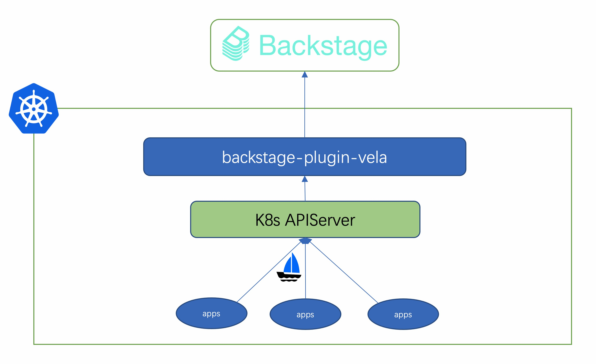

# backstage-plugin-kubevela

A plugin for backstage that can make kubevela application work as backstage services.

## What is Backstage and KubeVela

**Backstage** is an open platform for building developer portals. It unifies your infrastructure tooling, services, and documentation to create a streamlined development environment from end to end.

**KubeVela** is a modern software delivery platform that makes deploying and operating applications across today's hybrid, multi-cloud environments easier, faster and more reliable. It is infrastructure agnostic, programmable, yet most importantly, application-centric. It allows you to build powerful software, and deliver them anywhere!

## What's the benefit of combining KubeVela and Backstage

Backstage acts as a "platform of platforms" or marketplace between infra/platform teams and end-users. It sits on top of infrastructure and developer tooling, abstracting infrastructure away. It aims to remove context switching and cognitive overload that drag engineers down.

While KubeVela is more on the infrastructure side. It manages Application deployments and operation across cloud environments or clusters.

We figured out that it would be helpful for existing Backstage users to manage their KubeVela infrastructure. It can connect the infra/platform teams and end-users, without users having to be experts in infrastructure tools.

Instead of manually importing Backstage entities from KubeVela, by using this plugin, KubeVela Applications can be automatically synced to Backstage entities. So users can manage their KubeVela infra directly in Backstage without manual chore.

## Quick Demo

To see what this plugin does without installing it in your own backstage instance, there is a pre-configured reference backstage instance here [wonderflow/vela-backstage-demo](https://github.com/wonderflow/vela-backstage-demo).

You can follow the link to see how to give it a whirl, but the fastest way is to use the corresponding KubeVela addon, which will deploy this pre-configured instance and all of its dependencies for you. You probably already have KubeVela installed, if not, please follow the [installation guide](https://kubevela.io/docs/install). Once you have KubeVela installed in your Kubernetes cluster, you can run the following command to install the addon:

```shell
# Add experimental addon registry
vela addon registry add experimental --type=helm --endpoint=https://addons.kubevela.net/experimental
# Enable backstage demo addon
vela addon enable backstage
```

Wait a while for the addon to be installed, then you can test it locally by forwarding traffic to localhost:

```shell
vela port-forward addon-backstage -n vela-system
# Choose `local | backstage | backstage:7007' in the list
```

Your browser should open Backstage automatically. Watch the synced vela Applications.


Note that the addon is for demo purpose, so the backstage app is strictly serving on `127.0.0.1:7007`.

## Install to your own Backstage instance

After you try the demo, if you already have working Backstage instance and want to install this plugin, we will guide you through the process. In case you are confused or misconfigured something, you can always refer to the demo Backstage instance [wonderflow/vela-backstage-demo](https://github.com/wonderflow/vela-backstage-demo) .

We will accomplish two major tasks:
- Run vela-backstage connector to serve entities for backstage
- Configure your Backstage instance to use this plugin and connect to vela-backstage connector

### Run vela-backstage connector

The vela-backstage connector is what converts KubeVela Applications to Entities in the Backstage app. This is a separate Go program, so it can be run anywhere that has access to the Kubernetes API and your Backstage instance has access to. It is recommended to run it in the same Kubernetes cluster as the Backstage app, but it can also be run outside the cluster, e.g. on your local computer. If you want to run the connector outside the cluster, keep this in mind:

- the connector needs to access the Kubernetes API, so you need to provide the kubeconfig file or the service account token
- the kubeconfig file or the service account token needs to have the permission to `list` and `watch` `application` of `core.oam.dev` on the Kubernetes API
- your Backstage instance can access the connector

There are several ways to run vela-backstage connector. We will name a few of them here, you can choose the one that suits you best.

- If your Backstage instance is running outside the cluster, and you want to run the connector inside the cluster.
  You can only enable vela-backstage connector and expose it using NodePort
  ```shell
  vela addon registry add experimental --type=helm --endpoint=https://addons.kubevela.net/experimental
  vela addon enable backstage pluginOnly=true serviceType=NodePort
  ```
  Remember the endpoint of the NodePort service, you will need it later when configuring Backstage.
- If your Backstage instance is running inside the cluster, and you want to run the connector inside the cluster.
  You can only enable vela-backstage connector and expose it using ClusterIP
  ```shell
  vela addon registry add experimental --type=helm --endpoint=https://addons.kubevela.net/experimental
  vela addon enable backstage pluginOnly=true
  ```
  Remember the endpoint of the connector, which is `backstage-plugin-vela.vela-system:8080` you will need it later when configuring Backstage.
- If your Backstage instance is not deployed yet, and you want it and the connector to run inside the cluster.
  You can enable the backstage addon. But instead of using the demo Backstage instance, you will use your own image.
  ```shell
  vela addon registry add experimental --type=helm --endpoint=https://addons.kubevela.net/experimental
  vela addon enable backstage image="<my-backstage-image>"
  ```
  In this way, you will use `backstage-plugin-vela.vela-system:8080` when configuring Backstage to connect to the connector.
- If your Backstage instance is not deployed yet, you want it and the connector to run inside the cluster, but you don't want to use the Backstage addon we provided.
  You can use a KubeVela Application to deploy the connector and the Backstage instance.
  ```yaml
  apiVersion: core.oam.dev/v1beta1
  kind: Application
  metadata:
    name: backstage
    namespace: vela-system
  spec:
    components:
      - type: webservice
        name: backstage-plugin-vela # the connector
        properties:
          image: wonderflow/backstage-plugin-kubevela:latest
          exposeType: ClusterIP
          ports:
            - port: 8080
              protocol: TCP
              expose: true
        traits:
          - type: service-account
            properties:
              name: vela-app-read
              create: true
              privileges:
                - scope: cluster
                  apiGroups:
                    - core.oam.dev
                  resources:
                    - applications
                  verbs:
                    - list
                    - watch
      - type: webservice
        name: backstage
        properties:
          image: wonderflow/backstage:latest # Use your own backstage image
          exposeType: ClusterIP
          ports:
            - port: 7007
              protocol: TCP
              expose: true
        dependsOn:
          - backstage-plugin-vela
  ```
  In this way, you will use `backstage-plugin-vela.vela-system:8080` when configuring Backstage to connect to the connector.

No matter how you run the connector, now you should have a way to access it. We will assume you can access the connector at `http://backstage-plugin-vela.vela-system:8080` in the following steps.

### Configure your Backstage instance

If you haven't already created your own Backstage instance, you can create it by `npx @backstage/create-app`. In case you also want to build a container image, you can refer to the demo Backstage instance [wonderflow/vela-backstage-demo](https://github.com/wonderflow/vela-backstage-demo) for a Dockerfile.


First of all, we need to access the connector from our Backstage instance. By default, you cannot access arbitrary services. You need to configure the `app-config.yaml` to allow it. You can find the `app-config.yaml` in the root directory of your Backstage instance. **Merge** the following lines into your `app-config.yaml` to allow the access to the connector and configure vela services:

```yaml
# Merge the following lines into your app-config.yaml
backend:
  reading:
    allow:
      - host: backstage-plugin-vela.vela-system:8080 # Required, change this to the endpoint of the connector
      - host: raw.githubusercontent.com # Optional
      - host: kubevela.io # Optional
      - host: kubevela.net # Optional

catalog:
  rules:
    - allow: [Domain, System, Component, API, Location, Template, User, Group]
  providers:
# Give some configuration to the Vela Entity Provider
    vela:
      host: http://backstage-plugin-vela.vela-system:8080 # Change this to the endpoint of the connector
      schedule: #optional section
        initialDelay: { seconds: 30 }
        # frequency is the refresh rate for the Vela API, defaults to 60 seconds
        frequency: { hours: 30 }
        # timeout is the timeout limit for the Vela API, defaults to 600 seconds
        timeout: { minutes: 2 }
```

Configure Backstage to use the Vela Entity Provider with the new backend

```diff
 // packages/backend/src/index.ts
+import { VelaProvideriModule } from '@oamdev/plugin-kubevela-backend';
+backend.add(velaProviderModule);
```

#### configuring backstage with the older backend

```yaml
# Merge the following lines into your app-config.yaml
backend:
  reading:
    allow:
      - host: backstage-plugin-vela.vela-system:8080 # Required, change this to the endpoint of the connector
      - host: raw.githubusercontent.com # Optional
      - host: kubevela.io # Optional
      - host: kubevela.net # Optional

catalog:
  rules:
    - allow: [Domain, System, Component, API, Location, Template, User, Group]

# Give some configuration to the Vela Entity Provider
vela:
  host: http://backstage-plugin-vela.vela-system:8080 # Change this to the endpoint of the connector
  # frequency is the refresh rate for the Vela API, default to 60 seconds, the unit is seconds
  frequency: 30
  # timeout is the timeout limit for the Vela API, default to 600 seconds, the unit is seconds
  timeout: 60
```

Configure Backstage to use the Vela Entity Provider

```diff
 // packages/backend/src/plugins/catalog.ts
+import { VelaProvider } from '@oamdev/plugin-kubevela-backend';

 export default async function createPlugin(
   env: PluginEnvironment,
 ): Promise<Router> {
   const builder = await CatalogBuilder.create(env);

+  const vela = new VelaProvider('production', env.reader, env.config);
+  builder.addEntityProvider(vela);
+  const frequency: number = env.config.getOptionalNumber('vela.frequency') || 60;
+  const timeout: number = env.config.getOptionalNumber('vela.timeout') || 600;

   builder.addProcessor(new ScaffolderEntitiesProcessor());
   const { processingEngine, router } = await builder.build();
   await processingEngine.start();


+  await env.scheduler.scheduleTask({
+    id: 'run_vela_refresh',
+    fn: async () => { await vela.run(); },
+    frequency: { seconds: frequency },
+    timeout: { seconds: timeout },
+  });


   return router;
 }
```

### Optional step: add VelaUX page to sidebar

```diff
 // packages/app/src/components/Root/Root.tsx
+import { VelaLogo } from '@oamdev/backstage-plugin-velaux';

 export const Root = ({ children }: PropsWithChildren<{}>) => (
   <SidebarPage>
         {/* ... */}
         {/* End global nav */}
         <SidebarDivider />
         <SidebarScrollWrapper>
+          <SidebarItem icon={VelaLogo} to="velaux" text="VelaUX" />
         </SidebarScrollWrapper>
       {/* ... */}
   </SidebarPage>
 );
```

```diff
 // packages/app/src/App.tsx
+import { VelauxPage } from '@oamdev/backstage-plugin-velaux';

 const routes = (
   <FlatRoutes>
     {/* ... */}
     <Route path="/settings" element={<UserSettingsPage />} />
     <Route path="/catalog-graph" element={<CatalogGraphPage />} />
+    <Route path="/velaux" element={<VelauxPage />} />
     {/* ... */}
   </FlatRoutes>
 );
```

## System Model Integration

It leverages the [External integrations](https://backstage.io/docs/features/software-catalog/external-integrations) and works as a `Custom Entity Providers`.

This plugin will connect to Kubernetes API and request vela applications, it provides an API endpoint for serving entities for backstage app.



* A vela application will convert to a backstage system.
* Resources created by vela component, will convert to backstage components.
* Resources can be marked by annotations to represent more backstage information as the [Well Known Annotations](#Well-Known-Annotations) section described.  

## Well Known Annotations

KubeVela will sync with the backstage [Well-known Annotations](https://backstage.io/docs/features/software-catalog/well-known-annotations), besides that,
KubeVela adds some more annotations that can help sync data from vela application to backstage spec.

| Annotations                           |               Usage        |
| :------------------------------------: | :---------------------------------------:|
|    `backstage.oam.dev/owner`        |  Owner of the app synced to backstage |
|    `backstage.oam.dev/domain`        | Domain of the app synced to backstage  |
|    `backstage.oam.dev/system`        | System of the app synced to backstage, by default its the name of application  |
|    `backstage.oam.dev/description`        |    Description of the app synced to backstage | 
|    `backstage.oam.dev/title`        |   Title of the app synced to backstage |
|    `backstage.oam.dev/tags`        |   Tags of the app synced to backstage, split by `,`  |

Don't forget to checkout the [examples directory](https://github.com/kubevela-contrib/backstage-plugin-kubevela/tree/main/examples), which contains all kinds of usage examples. Common ones are:
- the annotations and labels of vela application will be automatically injected on syncing, while vela component need a backstage trait for this, check the [app.yaml](./examples/app.yaml) for details.
- You can configure `backstage-location` as the trait, then it will sync the backstage entity from the location targets. Check out [app-location.yaml](./examples/app-location.yaml) for details.
- You can also specify the backstage system if you want different vela apps in the same backstage system. Check out [app-with-system.yaml](./examples/app-with-system.yaml) for details.


## Future work

- [ ] Add [Well-known Relations between Catalog Entities](https://backstage.io/docs/features/software-catalog/well-known-relations)
- [ ] Add [Kind API](https://backstage.io/docs/features/software-catalog/descriptor-format#kind-api) to integrate with backstage API

## Contact

If you want more features, just raise an issue or even file a PR. If you have any question, you can raise an issue or join our [Slack channel](https://cloud-native.slack.com/archives/C01BLQ3HTJA) to discuss with us.
